``` r
library(data.table)
library(ggplot2)
library(ggResidpanel)
```

Our Regular Flow dataframe encompasses all the changes done against
tickets, including the time it takes for them to move between swimlanes

``` r
RegularFlow <- fread("RegularFlow.csv")
```

Since our research question only concerns development, we will use a
list given to use by a product owners of assignees we know are
developers.

``` r
#only grab devs
developers <- c('Alden Sharp','Alexander Strauss', 'Asha Jainand', 'Carson Ferraro', 'Jon Schipani', 'Jose Jarquin', 'Juan Altamonte', 'Pamela Bulu', 'Pedro Ortiz Rodriguez', 'Thapani Saweangsri', 'Vimal Kumar Sekar', 'Walker Carr')

RegularFlow <- RegularFlow[author.displayName %in% developers]
#filter onn developer list

# only pick up stories moving into in Progress, need to divide by 24 to get days, aggregate on ticket and other information
development_hours <- RegularFlow[fromString == "In Progress"][, .(reported_dev = sum(diff_hours)/24), by = .(sprint_name, storypoints, current_issue_type, author.displayName, component, issues.key)]
```

Looking at the density plots can help us see whether we are fulfilling
the asumptions for normality.

``` r
ggplot(development_hours, aes(x = reported_dev, fill =  as.factor(storypoints))) +
  geom_density(position = "stack") + ggtitle("Distribution of Reported Development by Storypoints (Stacked)")
```

    ## Warning: Removed 13 rows containing non-finite values (stat_density).

    ## Warning: Groups with fewer than two data points have been dropped.

    ## Warning: Removed 1 rows containing missing values (position_stack).

<!-- -->

With the transformation, we can see the ‘corrected’ distribution of
reported development, although it’s not entirely normal.

``` r
ggplot(development_hours, aes(x = log10(reported_dev), fill =  as.factor(storypoints))) +
  geom_density(position = "stack") + ggtitle("Distribution of Reported Development by Storypoints (Stacked and Log Transform)")
```

    ## Warning: Removed 13 rows containing non-finite values (stat_density).

    ## Warning: Groups with fewer than two data points have been dropped.

    ## Warning: Removed 1 rows containing missing values (position_stack).

<!-- -->

We can fit the lm model visually

``` r
ggplot(development_hours, aes(y=reported_dev, x = as.numeric(storypoints), color = storypoints)) +
  geom_point() + 
  geom_smooth(method = 'lm') +
  facet_wrap(author.displayName~.) + ggtitle("Fitted Linear Models by Developer")
```

    ## `geom_smooth()` using formula 'y ~ x'

    ## Warning: Removed 1269 rows containing non-finite values (stat_smooth).

    ## Warning: Removed 1269 rows containing missing values (geom_point).

<!-- -->

There are alot of outliers which don’t seem realistic for this dataset
(like 50 days in development), so we’ll see how many issues have
reported development over 15 days

``` r
nrow(development_hours[ reported_dev >= 15]) # tickets which stay in progress for more than 15 days will not be considered
```

    ## [1] 53

53 of the observations have days in which they are in progress for more
than 15 days, which seem very unlikely for the question we’re asking. We
will omit these from the dataset for now.

``` r
treshold <- 15

development_hours <- development_hours[ reported_dev <= treshold]

cat("This dataframe has", nrow(development_hours), "observations with ticket which stayed in progress for more than", treshold, "days removed.")
```

    ## This dataframe has 1803 observations with ticket which stayed in progress for more than 15 days removed.

With the outliers removed, we see a bimodal distribution emerge from our
storypoints, which is surprising since we see it across all the
storypoint categories

``` r
ggplot(development_hours, aes(x = log10(reported_dev), fill =  as.factor(storypoints))) +
  geom_density(position = "stack") + ggtitle("Distribution of Reported Development by Storypoints (Stacked and Log Transform)")
```

<!-- -->

``` r
ggplot(development_hours, aes(x = log10(reported_dev), fill =  as.factor(storypoints))) +
  geom_density(position = "stack") + ggtitle("Distribution of Reported Development by Storypoints (Stacked and Log Transform)") + facet_wrap(author.displayName~.)
```

<!-- -->

Across all the developers in our list, we see that some developers are
more consistent in terms of the distribution of how they point than
others.

If we visualize the transformation applied unto the scatterplots, we can
glean that it helps in terms of having more points lie on the line.

``` r
ggplot(development_hours, aes(y=reported_dev, x = as.numeric(storypoints), color = storypoints)) +
  geom_point() + 
  geom_smooth(method = 'lm') +
  facet_wrap(author.displayName~.) + ggtitle("Fitted Linear Models by Developer")
```

<!-- -->

We need to be able to combine the results from our model so we can
interpret it. We’ll create a few functions to do this:

1)  Subset data based on the value we want to subset on (author in this
    case)
2)  Function to fit the model
3)  Get metadata
4)  Produce table

<!-- end list -->

``` r
# create a function to get list of dataframes by developer 
get_subsets_data <- function(data, value, column_name) {
  data <- as.data.table(data)
  data[get(column_name) == value]
  
}
# may need to be modified 


# apply function to list of developers
developer_dataframe_profiles <- lapply(developers, get_subsets_data, data = development_hours, column_name = 'author.displayName')

# create an lm function with error handling

fit_lms <- function(developer_profiles, formula){
  
  #get the summary with the formula, formula is hardcoded here!
  summary(tryCatch(lm(formula, offset = rep(1, length(storypoints)), data = developer_profiles), error = function(e) NULL )) # fit the model
  # need to look into forcing intercept
  
}

#need to add developers to summary


# now we apply the linear model to each of the dataframes to return a list of lms
developer_lms <- lapply(developer_dataframe_profiles, fit_lms, formula = log10(reported_dev) ~ storypoints)


extract_metadata <- function(lm_summary){
    
  coeffs <- lm_summary$coefficients
  
  r_squared <- lm_summary$r.squared
  
  adjusted_rsquared <- lm_summary$adj.r.squared
  
  ftest <- pf(lm_summary$fstatistic[1], lm_summary$fstatistic[2], lm_summary$fstatistic[3], lower.tail = FALSE)
  
  model_metadata <- as.data.table( cbind(coeffs, r_squared, adjusted_rsquared, ftest))
  
  model_metadata
}
```

The rest of the functions are dedicated to naming the columns and make
them readable.

``` r
metadata_list <- lapply(developer_lms, function(X){
  
tryCatch(extract_metadata(X), error = function(e) NULL )
  
})

metadata_list_named <- Map(cbind, metadata_list, developers)

metadata_list_named <- lapply(metadata_list_named, as.data.table)

metadata_list_filtered <- Filter(function(x) length(x) > 1, metadata_list_named)


metadata_table <- rbindlist(metadata_list_filtered)

tags_intercept <- as.data.frame( rep(c('intercept', 'storypoints'), nrow(metadata_table)/2 ))

metadata_table <- cbind(metadata_table, tags_intercept)


setnames(metadata_table, "V2", "developer")

setnames(metadata_table,'rep(c("intercept", "storypoints"), nrow(metadata_table)/2)', 'tags')

setnames(metadata_table,'Pr(>|t|)', "p_value")


#need to convert back from log
metadata_table[, estimate_original := 1/log(Estimate)]
```

    ## Warning in log(Estimate): NaNs produced

``` r
metadata_table[tags == 'intercept'][order(estimate_original)]
```

    ##      Estimate Std. Error    t value      p_value   r_squared adjusted_rsquared
    ## 1: -1.0091695  0.4715113  -2.140287 7.612020e-02 0.150323082       0.008710262
    ## 2: -1.0105061  0.1960830  -5.153461 4.185256e-06 0.039427936       0.020593190
    ## 3: -1.3882430  0.4434355  -3.130653 1.210895e-02 0.200417123       0.111574581
    ## 4: -1.5705621  0.2028795  -7.741354 8.223019e-10 0.246202182       0.229451120
    ## 5: -1.6922493  0.2301645  -7.352346 2.881534e-11 0.031322671       0.023043378
    ## 6: -3.4416861  0.2387270 -14.416829 3.039440e-30 0.229641201       0.224573051
    ## 7: -1.8104852  0.2173920  -8.328207 2.588147e-12 0.198570636       0.188025513
    ## 8: -0.9645661  0.3189469  -3.024221 4.068706e-03 0.008020556      -0.013544215
    ## 9: -1.0160142  0.2585232  -3.930069 2.897602e-04 0.029419682       0.007851231
    ##           ftest             developer      tags estimate_original
    ## 1: 3.426017e-01           Alden Sharp intercept               NaN
    ## 2: 1.540590e-01     Alexander Strauss intercept               NaN
    ## 3: 1.673541e-01        Carson Ferraro intercept               NaN
    ## 4: 3.896462e-04          Jon Schipani intercept               NaN
    ## 5: 5.416719e-02          Jose Jarquin intercept               NaN
    ## 6: 3.231851e-10           Pamela Bulu intercept               NaN
    ## 7: 4.343691e-05 Pedro Ortiz Rodriguez intercept               NaN
    ## 8: 5.449559e-01     Vimal Kumar Sekar intercept               NaN
    ## 9: 2.489937e-01           Walker Carr intercept               NaN

``` r
metadata_table[ftest <= 0.10 & tags == 'storypoints'][order(estimate_original)]
```

    ##     Estimate Std. Error  t value      p_value  r_squared adjusted_rsquared
    ## 1: 0.4718689 0.07010050 6.731319 3.231851e-10 0.22964120        0.22457305
    ## 2: 0.4075063 0.09390801 4.339420 4.343691e-05 0.19857064        0.18802551
    ## 3: 0.2556626 0.06668720 3.833759 3.896462e-04 0.24620218        0.22945112
    ## 4: 0.1784447 0.09174259 1.945059 5.416719e-02 0.03132267        0.02304338
    ##           ftest             developer        tags estimate_original
    ## 1: 3.231851e-10           Pamela Bulu storypoints        -1.3314619
    ## 2: 4.343691e-05 Pedro Ortiz Rodriguez storypoints        -1.1139593
    ## 3: 3.896462e-04          Jon Schipani storypoints        -0.7331934
    ## 4: 5.416719e-02          Jose Jarquin storypoints        -0.5802226

Since we need to be able to apply this function to different sets of
data, not just developers, we’ll create a uniform function,
get\_lm\_metadata, so that an end\_user can use this to explore other
dimensions.

``` r
get_lm_metadata <- function(data, filter_vector, column_name_target, lm_formula) {
  
data_profiles <- lapply(filter_vector, get_subsets_data, data = development_hours, column_name = column_name_target)

lm_profiles <- lapply(data_profiles, fit_lms, formula = lm_formula)

metadata_list <- lapply(lm_profiles, function(X){
  
tryCatch(extract_metadata(X), error = function(e) NULL )
  
})
  


metadata_list_named <- Map(cbind, metadata_list, filter_vector)


metadata_list_named <- lapply(metadata_list_named, as.data.table)

metadata_list_filtered <- Filter(function(x) length(x) > 1, metadata_list_named)


metadata_table <- rbindlist(metadata_list_filtered)

tags_intercept <- as.data.frame( rep(c('intercept', 'storypoints'), nrow(metadata_table)/2 ))

metadata_table <- cbind(metadata_table, tags_intercept)


setnames(metadata_table, "V2", column_name_target)

setnames(metadata_table,'rep(c("intercept", "storypoints"), nrow(metadata_table)/2)', 'tags')

setnames(metadata_table,'Pr(>|t|)', "p_value")


#need to convert back from log
metadata_table[, estimate_original_units := 10*(Estimate)]

as.data.table(metadata_table)
# enable flexibility to get unstraformed estimate
# some column names are not making sense
#metadata_table[ftest <= 0.10 & tags == 'storypoints'][order(estimate_original)]

}
```

Now we can use the general function to pull all of our metadata. As a
reminder: Our entire model is significant only if the ftest is lower
than our alpha value, so we need to filter on below α to see the
signicant models for our profiles of data. To use this function, we
would just need to source the function from the file again to use it
again.

``` r
# same metadata as before, but now we can just call our list of devs and the target column to get our metadata 
developer_profiles <- get_lm_metadata(development_hours, developers, 'author.displayName', lm_formula =  log10(reported_dev) ~ storypoints)

developer_profiles[tags == 'storypoints'][ftest <= 0.10]
```

    ##     Estimate Std. Error  t value      p_value  r_squared adjusted_rsquared
    ## 1: 0.2556626 0.06668720 3.833759 3.896462e-04 0.24620218        0.22945112
    ## 2: 0.1784447 0.09174259 1.945059 5.416719e-02 0.03132267        0.02304338
    ## 3: 0.4718689 0.07010050 6.731319 3.231851e-10 0.22964120        0.22457305
    ## 4: 0.4075063 0.09390801 4.339420 4.343691e-05 0.19857064        0.18802551
    ##           ftest    author.displayName        tags estimate_original_units
    ## 1: 3.896462e-04          Jon Schipani storypoints                2.556626
    ## 2: 5.416719e-02          Jose Jarquin storypoints                1.784447
    ## 3: 3.231851e-10           Pamela Bulu storypoints                4.718689
    ## 4: 4.343691e-05 Pedro Ortiz Rodriguez storypoints                4.075063

``` r
components <- c('Faculty / Staff Pod', 'myBullsPath', 'Offshore', 'Platform', 'ReturntoCampus', 'Student Value')

# now we can do the same for components


team_profiles <- get_lm_metadata(development_hours, components, 'component', lm_formula =  log10(reported_dev) ~ storypoints)

team_profiles[tags == 'storypoints'][ftest <= 0.10]
```

    ##     Estimate Std. Error   t value      p_value r_squared adjusted_rsquared
    ## 1: 0.5191560 0.08057853  6.442858 1.366028e-09 0.2091095         0.2040720
    ## 2: 0.3076459 0.06935554  4.435779 3.230796e-05 0.2146266         0.2037186
    ## 3: 0.4480223 0.03830555 11.696015 5.429843e-02 0.9927429         0.9854859
    ##           ftest           component        tags estimate_original_units
    ## 1: 1.366028e-09 Faculty / Staff Pod storypoints                5.191560
    ## 2: 3.230796e-05         myBullsPath storypoints                3.076459
    ## 3: 5.429843e-02      ReturntoCampus storypoints                4.480223

One last step: We’ll use the resid panel function to examine whether the
assumptions of the model are being violated. It looks like the log
transformation does make sense for correcting some heteroscedacity.

``` r
get_model <- function(developer_profiles, formula){
  
    tryCatch(lm(formula, offset = rep(1, length(storypoints)), data = developer_profiles), error = function(e) NULL ) # fit the model

  
}

developer_lms_log <- lapply(developer_dataframe_profiles, get_model, formula = log10(reported_dev) ~ storypoints)


developer_lms_originalunits <- lapply(developer_dataframe_profiles, get_model, formula = reported_dev ~ storypoints)

developer_lms_log
```

    ## [[1]]
    ## 
    ## Call:
    ## lm(formula = formula, data = developer_profiles, offset = rep(1, 
    ##     length(storypoints)))
    ## 
    ## Coefficients:
    ## (Intercept)  storypoints  
    ##     -1.0092       0.1191  
    ## 
    ## 
    ## [[2]]
    ## 
    ## Call:
    ## lm(formula = formula, data = developer_profiles, offset = rep(1, 
    ##     length(storypoints)))
    ## 
    ## Coefficients:
    ## (Intercept)  storypoints  
    ##     -1.0105       0.0904  
    ## 
    ## 
    ## [[3]]
    ## NULL
    ## 
    ## [[4]]
    ## 
    ## Call:
    ## lm(formula = formula, data = developer_profiles, offset = rep(1, 
    ##     length(storypoints)))
    ## 
    ## Coefficients:
    ## (Intercept)  storypoints  
    ##      -1.388        0.159  
    ## 
    ## 
    ## [[5]]
    ## 
    ## Call:
    ## lm(formula = formula, data = developer_profiles, offset = rep(1, 
    ##     length(storypoints)))
    ## 
    ## Coefficients:
    ## (Intercept)  storypoints  
    ##     -1.5706       0.2557  
    ## 
    ## 
    ## [[6]]
    ## 
    ## Call:
    ## lm(formula = formula, data = developer_profiles, offset = rep(1, 
    ##     length(storypoints)))
    ## 
    ## Coefficients:
    ## (Intercept)  storypoints  
    ##     -1.6922       0.1784  
    ## 
    ## 
    ## [[7]]
    ## NULL
    ## 
    ## [[8]]
    ## 
    ## Call:
    ## lm(formula = formula, data = developer_profiles, offset = rep(1, 
    ##     length(storypoints)))
    ## 
    ## Coefficients:
    ## (Intercept)  storypoints  
    ##     -3.4417       0.4719  
    ## 
    ## 
    ## [[9]]
    ## 
    ## Call:
    ## lm(formula = formula, data = developer_profiles, offset = rep(1, 
    ##     length(storypoints)))
    ## 
    ## Coefficients:
    ## (Intercept)  storypoints  
    ##     -1.8105       0.4075  
    ## 
    ## 
    ## [[10]]
    ## NULL
    ## 
    ## [[11]]
    ## 
    ## Call:
    ## lm(formula = formula, data = developer_profiles, offset = rep(1, 
    ##     length(storypoints)))
    ## 
    ## Coefficients:
    ## (Intercept)  storypoints  
    ##    -0.96457      0.04825  
    ## 
    ## 
    ## [[12]]
    ## 
    ## Call:
    ## lm(formula = formula, data = developer_profiles, offset = rep(1, 
    ##     length(storypoints)))
    ## 
    ## Coefficients:
    ## (Intercept)  storypoints  
    ##     -1.0160       0.1244

``` r
developer_lms_originalunits
```

    ## [[1]]
    ## 
    ## Call:
    ## lm(formula = formula, data = developer_profiles, offset = rep(1, 
    ##     length(storypoints)))
    ## 
    ## Coefficients:
    ## (Intercept)  storypoints  
    ##      1.1833       0.5048  
    ## 
    ## 
    ## [[2]]
    ## 
    ## Call:
    ## lm(formula = formula, data = developer_profiles, offset = rep(1, 
    ##     length(storypoints)))
    ## 
    ## Coefficients:
    ## (Intercept)  storypoints  
    ##     0.06207      0.93166  
    ## 
    ## 
    ## [[3]]
    ## NULL
    ## 
    ## [[4]]
    ## 
    ## Call:
    ## lm(formula = formula, data = developer_profiles, offset = rep(1, 
    ##     length(storypoints)))
    ## 
    ## Coefficients:
    ## (Intercept)  storypoints  
    ##     -0.2474       0.5855  
    ## 
    ## 
    ## [[5]]
    ## 
    ## Call:
    ## lm(formula = formula, data = developer_profiles, offset = rep(1, 
    ##     length(storypoints)))
    ## 
    ## Coefficients:
    ## (Intercept)  storypoints  
    ##      -1.106        1.051  
    ## 
    ## 
    ## [[6]]
    ## 
    ## Call:
    ## lm(formula = formula, data = developer_profiles, offset = rep(1, 
    ##     length(storypoints)))
    ## 
    ## Coefficients:
    ## (Intercept)  storypoints  
    ##      1.1388       0.1316  
    ## 
    ## 
    ## [[7]]
    ## NULL
    ## 
    ## [[8]]
    ## 
    ## Call:
    ## lm(formula = formula, data = developer_profiles, offset = rep(1, 
    ##     length(storypoints)))
    ## 
    ## Coefficients:
    ## (Intercept)  storypoints  
    ##      -1.343        1.072  
    ## 
    ## 
    ## [[9]]
    ## 
    ## Call:
    ## lm(formula = formula, data = developer_profiles, offset = rep(1, 
    ##     length(storypoints)))
    ## 
    ## Coefficients:
    ## (Intercept)  storypoints  
    ##      -1.109        1.568  
    ## 
    ## 
    ## [[10]]
    ## NULL
    ## 
    ## [[11]]
    ## 
    ## Call:
    ## lm(formula = formula, data = developer_profiles, offset = rep(1, 
    ##     length(storypoints)))
    ## 
    ## Coefficients:
    ## (Intercept)  storypoints  
    ##       4.612        0.014  
    ## 
    ## 
    ## [[12]]
    ## 
    ## Call:
    ## lm(formula = formula, data = developer_profiles, offset = rep(1, 
    ##     length(storypoints)))
    ## 
    ## Coefficients:
    ## (Intercept)  storypoints  
    ##      1.0599       0.8541

``` r
resid_panel(developer_lms_log[[1]])
```

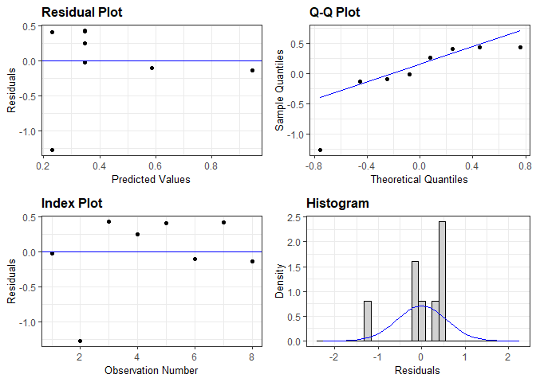<!-- -->

``` r
resid_panel(developer_lms_log[[2]])
```

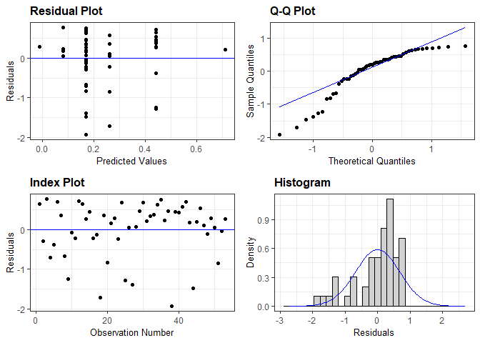<!-- -->

``` r
resid_panel(developer_lms_log[[4]])
```

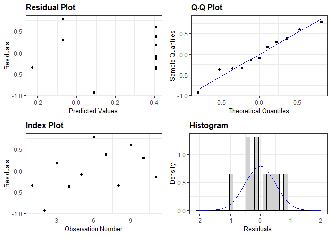<!-- -->

``` r
resid_panel(developer_lms_log[[5]])
```

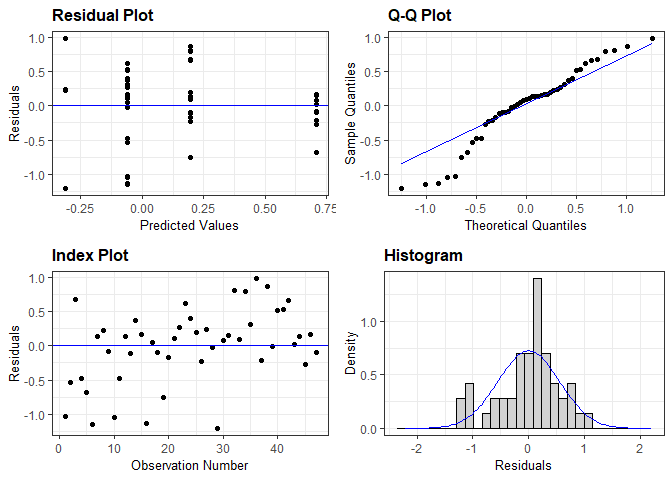<!-- -->

``` r
resid_panel(developer_lms_log[[6]])
```

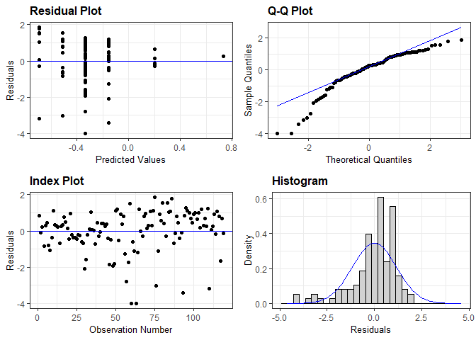<!-- -->

``` r
resid_panel(developer_lms_log[[8]])
```

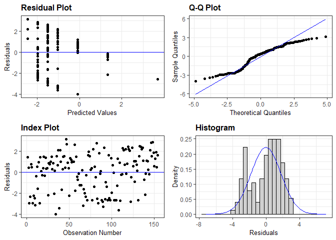<!-- -->

``` r
resid_panel(developer_lms_log[[9]])
```

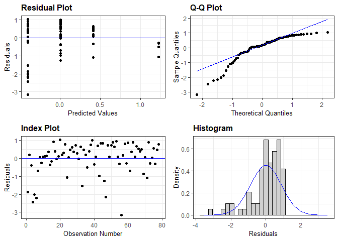<!-- -->

``` r
resid_panel(developer_lms_log[[11]])
```

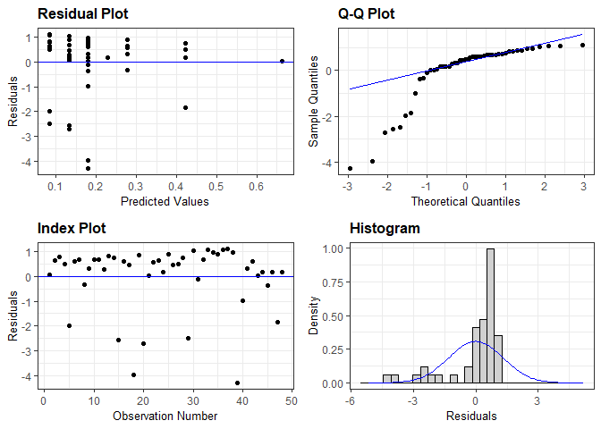<!-- -->

``` r
resid_panel(developer_lms_log[[12]])
```

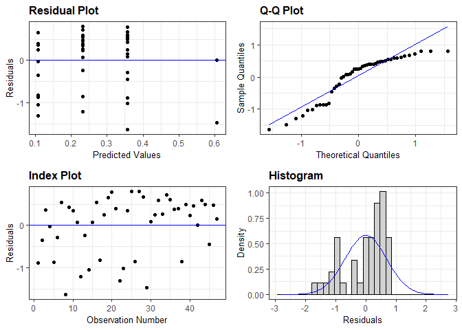<!-- -->

``` r
resid_panel(developer_lms_originalunits[[1]])
```

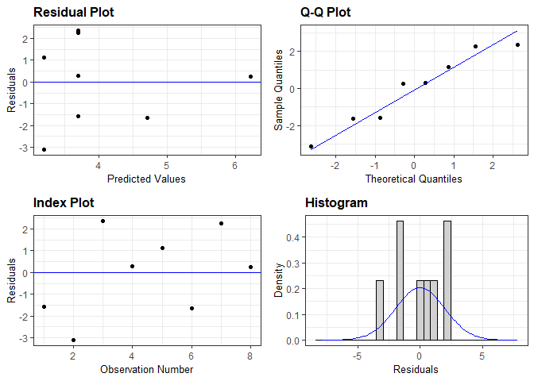<!-- -->

``` r
resid_panel(developer_lms_originalunits[[2]])
```

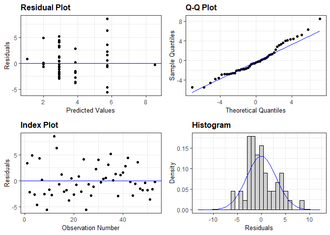<!-- -->

``` r
resid_panel(developer_lms_originalunits[[4]])
```

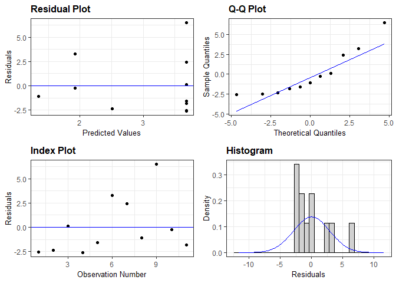<!-- -->

``` r
resid_panel(developer_lms_originalunits[[5]])
```

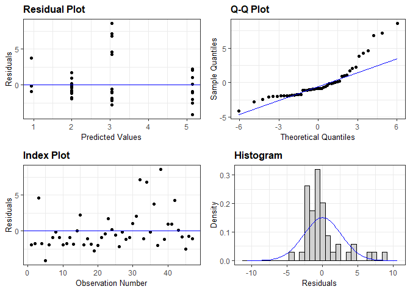<!-- -->

``` r
resid_panel(developer_lms_originalunits[[6]])
```

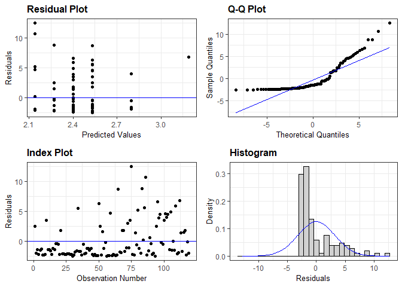<!-- -->

``` r
resid_panel(developer_lms_originalunits[[8]])
```

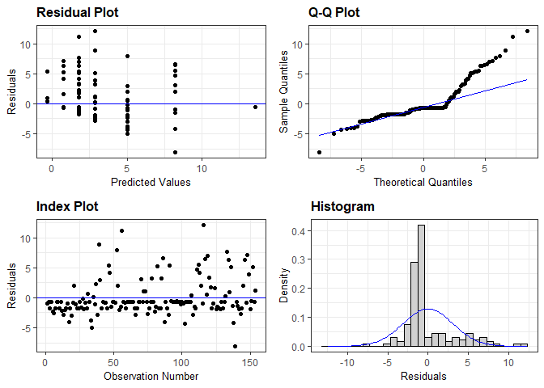<!-- -->

``` r
resid_panel(developer_lms_originalunits[[9]])
```

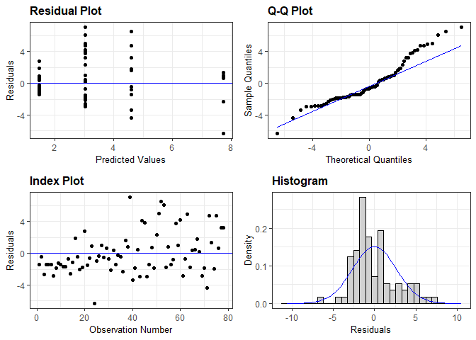<!-- -->

``` r
resid_panel(developer_lms_originalunits[[11]])
```

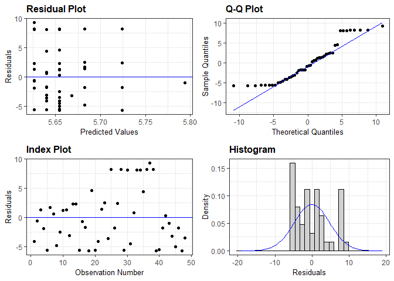<!-- -->

``` r
resid_panel(developer_lms_originalunits[[12]])
```

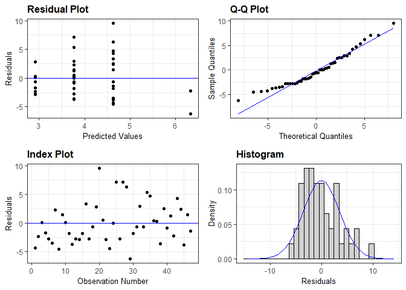<!-- -->
